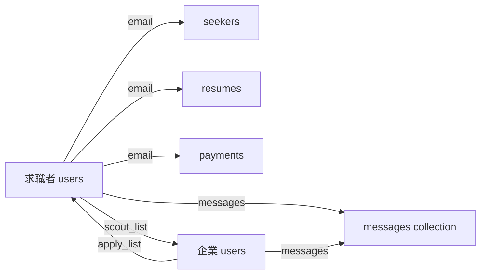

# Resume Truemee データベース設計書

## 📊 データベース概要

### アーキテクチャ
- **メインデータベース**: Google Firestore (NoSQL)
- **開発用データベース**: SQLite（Djangoデフォルト）
- **ORM**: 使用せず（Firestore直接操作）
- **認証**: Firebase Authentication + JWT

### 特徴
- NoSQLによる柔軟なスキーマ設計
- ユーザータイプ（求職者/企業）による異なるデータ構造
- リアルタイム同期機能（Firestoreの特性を活用）

## 🗂 コレクション構造

### 1. メインコレクション一覧

| コレクション名 | 用途 | ドキュメントID | 主要ユーザー |
|---|---|---|---|
| `users` | ユーザー基本情報 | UID (求職者) / email (企業) | 求職者・企業 |
| `seekers` | 求職者詳細情報 | email | 求職者 |
| `resumes` | 履歴書データ | email | 求職者 |
| `payments` | 支払い情報 | user_email | 求職者・企業 |
| `messages` | メッセージ履歴 | 自動生成ID | 全ユーザー |
| `histories` | 履歴情報 | email | 求職者 |

## 📋 詳細データ構造

### 1. `users` コレクション

#### 1.1 求職者ドキュメント (role: "user")

```javascript
{
  // 基本情報
  "id": string,              // Firebase Auth UID
  "email": string,           // メールアドレス（必須、ユニーク）
  "full_name": string,       // 氏名
  "kana": string,           // カナ氏名
  "phone": string,          // 電話番号
  "gender": string,         // 性別（"男性" | "女性" | "その他"）
  "password": string,       // ハッシュ化されたパスワード
  "role": "user",           // ロール（固定値）
  "created_at": Timestamp,  // 作成日時
  
  // マッチング機能
  "apply": boolean,         // 応募状態フラグ
  "scout_list": string[],   // スカウトを受けた企業のemailリスト
  
  // メッセージ機能
  "messages": [
    {
      "companyName": string,  // 送信企業名
      "message": string,      // メッセージ内容
      "sentAt": Timestamp     // 送信日時（オプション）
    }
  ]
}
```

#### 1.2 企業ドキュメント (role: "company")

```javascript
{
  // 基本情報
  "email": string,            // メールアドレス（必須、ユニーク、ID として使用）
  "first_name": string,       // 担当者名（姓）
  "last_name": string,        // 担当者名（名）
  "phone": string,            // 電話番号
  "password": string,         // ハッシュ化されたパスワード
  "role": "company",          // ロール（固定値）
  "created_at": Timestamp,    // 作成日時
  
  // 企業情報
  "company_name": string,     // 企業名
  "capital": string,          // 資本金（例："1億円"）
  "url": string,              // 企業URL
  "campaign_code": string,    // キャンペーンコード（オプション）
  
  // マッチング機能
  "scout": boolean,           // スカウト実行状態フラグ
  "apply_list": string[],     // 応募を受けた求職者のemailリスト
  
  // サブスクリプション
  "subscriptions": {
    "premiumPlan": boolean,   // プレミアムプラン加入状態
    "planExpiry": Timestamp   // プラン有効期限（オプション）
  },
  
  // メッセージ機能
  "messages": [
    {
      "userName": string,     // 送信者名
      "message": string,      // メッセージ内容
      "sentAt": Timestamp     // 送信日時（オプション）
    }
  ]
}
```

### 2. `seekers` コレクション

求職者の詳細プロフィール情報

```javascript
{
  // 個人情報
  "email_or_id": string,         // メールアドレスまたはID
  "first_name": string,           // 名
  "last_name": string,            // 姓
  "first_name_kana": string,     // 名（カナ）
  "last_name_kana": string,       // 姓（カナ）
  "birthday": string,             // 生年月日（"YYYY-MM-DD"形式）
  "sex": string,                  // 性別
  "phone": string,                // 電話番号
  "prefecture": string,           // 都道府県
  
  // 学歴情報
  "faculty": string,              // 学部・学科
  "graduation_year": string,      // 卒業年度（オプション）
  
  // キャリア情報
  "experience_years": number,     // 経験年数（オプション）
  "current_salary": string,       // 現在の年収（オプション）
  "desired_salary": string,       // 希望年収（オプション）
  
  // その他
  "updated_at": Timestamp         // 更新日時（オプション）
}
```

### 3. `resumes` コレクション

履歴書・職務経歴書データ

```javascript
{
  "email": string,                  // ユーザーのメールアドレス
  "submittedAt": string,           // 提出日時（ISO 8601形式）
  
  // 職歴情報（配列）
  "experiences": [
    {
      "id": number,                // 経験ID（1から連番）
      "company": string,           // 会社名
      "periodFrom": string,        // 開始年月（"YYYY-MM"形式）
      "periodTo": string,          // 終了年月（"YYYY-MM"形式、現在の場合は"現在"）
      "employment_type": string,   // 雇用形態（"正社員" | "派遣" | "アルバイト"）
      "business": string,          // 事業内容
      "capital": string,           // 資本金
      "teamSize": string,          // チーム規模
      "tasks": string,             // 職務内容・実績（長文テキスト）
      "position": string,          // 役職（オプション）
      "industry": string           // 業界（オプション）
    }
  ],
  
  // スキル情報（単一オブジェクト）
  "skill": {
    "id": number,                  // スキルID（通常1）
    "skill": string                // スキル詳細（長文テキスト）
  },
  
  // 自己PR（単一オブジェクト）
  "profile": {
    "id": number,                  // プロフィールID（通常1）
    "profile": string              // 自己PR文（長文テキスト）
  },
  
  // 希望職種（単一オブジェクト）
  "job": {
    "id": number,                  // ジョブID（通常1）
    "job": string,                 // 希望職種
    "desired_industries": string[],// 希望業界（配列、オプション）
    "desired_locations": string[]  // 希望勤務地（配列、オプション）
  }
}
```

### 4. `payments` コレクション

支払い情報（2種類のサブタイプ）

#### 4.1 クレジットカード情報

```javascript
{
  "email": string,                // ユーザーのメールアドレス
  "paymentMethod": "credit",      // 支払い方法（固定値）
  "cardNumber": string,          // カード番号（マスク済み："****-****-****-1234"）
  "cardHolder": string,          // カード名義人
  "cardExpiry": string,          // 有効期限（"MM/YY"形式）
  "cardCvv": string,             // CVVコード（保存は推奨されない）
  "updatedAt": Timestamp         // 更新日時
}
```

#### 4.2 銀行口座情報

```javascript
{
  "email": string,                // ユーザーのメールアドレス
  "paymentMethod": "bank",        // 支払い方法（固定値）
  "bankName": string,            // 銀行名
  "branchName": string,          // 支店名
  "accountType": string,         // 口座種別（"普通" | "当座"）
  "accountNumber": string,       // 口座番号
  "accountHolder": string,       // 口座名義人（カタカナ）
  "updatedAt": Timestamp         // 更新日時
}
```

### 5. `messages` コレクション

システムメッセージ・管理者連絡用

```javascript
{
  "sender": string,               // 送信者email
  "receiver": string,             // 受信者（"admin" または specific email）
  "content": {
    "message": string,            // メッセージ本文
    "subject": string,            // 件名（オプション）
    "attachments": string[],      // 添付ファイルURL（オプション）
    "metadata": object            // その他メタデータ（オプション）
  },
  "created_at": Timestamp,        // 作成日時
  "read": boolean,                // 既読フラグ（オプション）
  "replied": boolean              // 返信済みフラグ（オプション）
}
```

### 6. `histories` コレクション

ユーザー活動履歴（限定的使用）

```javascript
{
  "email": string,                // ユーザーのメールアドレス
  "action": string,               // アクション種別
  "timestamp": Timestamp,         // 実行日時
  "details": object               // 詳細情報（任意構造）
}
```

## 🔗 データリレーション

### 1. ユーザー間のリレーション



### 2. 応募・スカウトフロー

#### 応募フロー
1. 求職者が企業に応募
2. 求職者の `users.apply` → `true`
3. 企業の `users.apply_list` に求職者のemailを追加

#### スカウトフロー
1. 企業が求職者をスカウト
2. 企業の `users.scout` → `true`
3. 求職者の `users.scout_list` に企業のemailを追加

## 🚨 設計上の問題点と改善提案

### 現在の問題点

1. **ID の不統一**
   - 求職者：Firebase UID使用
   - 企業：email使用
   - 混在による複雑性

2. **データの重複**
   - `users`と`seekers`で同じ情報を保持
   - 更新時の不整合リスク

3. **スケーラビリティ**
   - `apply_list`、`scout_list`が配列
   - 大量データ時のパフォーマンス問題

4. **セキュリティ**
   - パスワードをFirestoreに保存（Firebase Auth使用推奨）
   - CVVコードの保存は危険

### 改善提案

#### 1. ID統一化
```javascript
// 全ユーザーでFirebase UIDを使用
{
  "id": "firebase_uid",  // 統一ID
  "email": "user@example.com",
  "role": "user" | "company"
}
```

#### 2. リレーション専用コレクション
```javascript
// applications コレクション
{
  "applicant_id": "user_uid",
  "company_id": "company_uid",
  "applied_at": Timestamp,
  "status": "pending" | "accepted" | "rejected"
}

// scouts コレクション
{
  "company_id": "company_uid",
  "seeker_id": "user_uid",
  "scouted_at": Timestamp,
  "status": "sent" | "viewed" | "responded"
}
```

#### 3. セキュリティ強化
- Firebase Authenticationに認証を完全移行
- Stripe Payment Methodsを使用した安全な決済
- Firestore Security Rulesの適切な設定

#### 4. データ正規化
```javascript
// users_profiles コレクション（共通）
// seekers_details コレクション（求職者専用）
// companies_details コレクション（企業専用）
```

## 📝 備考

- 現在のシステムはFirestoreの特性を活かした設計
- NoSQLの柔軟性を活用しているが、データ整合性に課題
- 本番運用前にセキュリティとスケーラビリティの改善が必要
- Django ORMは使用せず、Firestoreに完全依存した設計