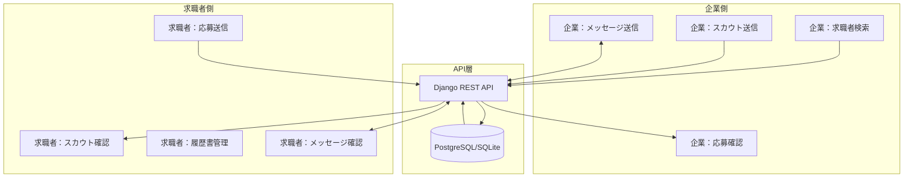

# 求人マッチングシステム 機能連携仕様書

## 📋 概要
本システムは企業と求職者を繋ぐ求人マッチングプラットフォームで、双方向のコミュニケーションとマッチング機能を提供します。

## 🔄 主要機能の連携フロー

### 1. スカウト機能（企業 → 求職者）

#### データモデル
```python
Scout:
  - company: 企業ユーザー（FK）
  - seeker: 求職者ユーザー（FK）  
  - scout_message: スカウトメッセージ
  - status: sent/viewed/responded/expired
  - match_score: AIマッチングスコア
```

#### APIエンドポイント

**API v1 (レガシー)**
- `POST /api/v1/scouts/` - スカウト送信
- `GET /api/v1/scouts/` - スカウト一覧取得
- `POST /api/v1/scouts/{id}/view/` - 閲覧処理
- `POST /api/v1/scouts/{id}/respond/` - 返信処理

**API v2 (推奨)**
- `POST /api/v2/scouts/` - スカウト送信（拡張機能付き）
- `GET /api/v2/scouts/` - スカウト一覧取得
- `POST /api/v2/scouts/{id}/mark_viewed/` - 閲覧処理

#### 画面フロー
1. **企業側**
   - `/company/page.tsx` - 求職者検索・スカウト送信
   - `/company/seekers-scouted/page.tsx` - 送信済みスカウト管理

2. **求職者側**
   - `/scouts/page.tsx` - 受信スカウト確認・返信
   - 通知パネルで新着スカウト数表示

### 2. 応募機能（求職者 → 企業）

#### データモデル
```python
Application:
  - applicant: 求職者ユーザー（FK）
  - company: 企業ユーザー（FK）
  - resume: 使用した履歴書（FK）
  - status: pending/viewed/accepted/interview/offered/rejected/hired/withdrawn
  - match_score: AIマッチングスコア
```

#### APIエンドポイント

**API v1 (レガシー)**
- `POST /api/v1/applications/` - 応募作成
- `GET /api/v1/applications/` - 応募一覧取得
- `POST /api/v1/applications/{id}/update_status/` - ステータス更新

**API v2 (推奨)**
- `POST /api/v2/applications/` - 応募作成（拡張機能付き）
- `GET /api/v2/applications/` - 応募一覧取得
- `PATCH /api/v2/applications/{id}/` - ステータス更新

#### 画面フロー
1. **求職者側**
   - `/applications/page.tsx` - 応募管理・ステータス確認
   - 企業詳細から直接応募

2. **企業側**
   - `/company/seekers-applied/page.tsx` - 受信応募確認
   - 応募者の履歴書閲覧・選考状況更新

### 3. メッセージ機能（双方向）

#### データモデル
```python
Message:
  - sender: 送信者（FK）
  - receiver: 受信者（FK）
  - subject: 件名
  - content: 内容
  - is_read: 既読フラグ
  - application: 関連応募（FK, optional）
  - scout: 関連スカウト（FK, optional）
```

#### APIエンドポイント
- `POST /api/v1/messages/` - メッセージ送信
- `GET /api/v1/messages/` - メッセージ一覧
- `GET /api/v1/messages/unread_count/` - 未読数取得
- `POST /api/v1/messages/{id}/mark_read/` - 既読処理

## 🔔 通知システム

### 通知の種類
1. **新着スカウト** - 企業からのスカウト受信時
2. **応募ステータス変更** - 選考状況の更新時
3. **新着メッセージ** - メッセージ受信時
4. **システム通知** - 重要なお知らせ

### 通知の表示
- ダッシュボード上部の通知パネル
- 各機能ページでの未読バッジ表示
- （今後実装）リアルタイム通知、プッシュ通知

## 📊 データフロー図



## 🚀 実装状況

### ✅ 実装済み機能
- [x] 企業からのスカウト送信・管理
- [x] 求職者からの応募送信・管理
- [x] 双方向メッセージング
- [x] 履歴書作成・管理
- [x] 認証・認可システム（JWT）
- [x] ロールベースアクセス制御
- [x] APIバージョニング（v1/v2）
- [x] レスポンシブデザイン
- [x] **API v2 拡張機能**
  - [x] 職歴詳細管理（期間計算、現在勤務判定）
  - [x] 学歴詳細管理（学校・学部・専攻）
  - [x] 資格詳細管理（有効期限、発行機関）
  - [x] UUID主キー、安全なID管理
  - [x] リアルタイム統計ダッシュボード
  - [x] 段階的API移行サポート

### ⚠️ 部分実装/改善必要
- [ ] リアルタイム通知（WebSocket）
- [ ] プッシュ通知
- [ ] メール通知連携
- [ ] 高度な検索フィルター
- [ ] AIマッチング機能の実装

## 🔐 セキュリティ考慮事項

1. **認証・認可**
   - JWT トークンによる認証
   - ロールベースのアクセス制御
   - トークンリフレッシュ機構

2. **データアクセス制御**
   - 企業は応募者/スカウト対象者の履歴書のみ閲覧可能
   - 求職者は自分宛のスカウト/メッセージのみ閲覧可能
   - QuerySetレベルでのフィルタリング実装

3. **API保護**
   - CORS設定
   - レート制限（今後実装推奨）
   - 入力検証・サニタイゼーション

## 📈 パフォーマンス最適化

1. **データベース最適化**
   - 適切なインデックス設定
   - N+1問題の回避（prefetch_related使用）
   - ページネーション実装

2. **フロントエンド最適化**
   - 遅延ローディング
   - キャッシュ活用
   - 最適化されたAPIコール

## 🛠️ 開発環境での動作確認

### バックエンド起動
```bash
cd back
./venv_new/bin/python3.13 manage.py runserver
```

### フロントエンド起動
```bash
cd frontend
npm run dev
```

### テストユーザー
- 求職者: `test_new_329d5794@example.com` / `testpass123`
- 企業: 別途作成が必要

### API v2 テスト機能
- ログイン画面: API v1⇔v2 切り替えトグル
- ダッシュボード: リアルタイム統計表示
- 履歴書作成: 職歴・学歴・資格の詳細管理

## 📝 今後の拡張計画

1. **短期（1-2週間）**
   - WebSocketによるリアルタイム通知
   - メール通知システム
   - 検索機能の強化

2. **中期（1-2ヶ月）**
   - AIマッチング機能の実装
   - レコメンデーションシステム
   - 分析ダッシュボード

3. **長期（3-6ヶ月）**
   - モバイルアプリ開発
   - ビデオ面接機能
   - 多言語対応

## 🔧 トラブルシューティング

### よくある問題と解決方法

1. **ログインできない**
   - トークンの有効期限確認
   - API v1/v2の切り替え確認
   - ロール（企業/求職者）の確認

2. **スカウト/応募が表示されない**
   - 認証トークンの確認
   - APIエンドポイントの確認
   - QuerySetフィルタリングの確認

3. **メッセージが送信できない**
   - 受信者の存在確認
   - 必須フィールドの確認
   - ネットワーク接続の確認

## 📚 関連ドキュメント

- [API仕様書](./API_SPECIFICATION.md)（作成予定）
- [データベース設計書](./DATABASE_DESIGN.md)（作成予定）
- [フロントエンド設計書](./FRONTEND_DESIGN.md)（作成予定）

---

最終更新日: 2025年8月29日